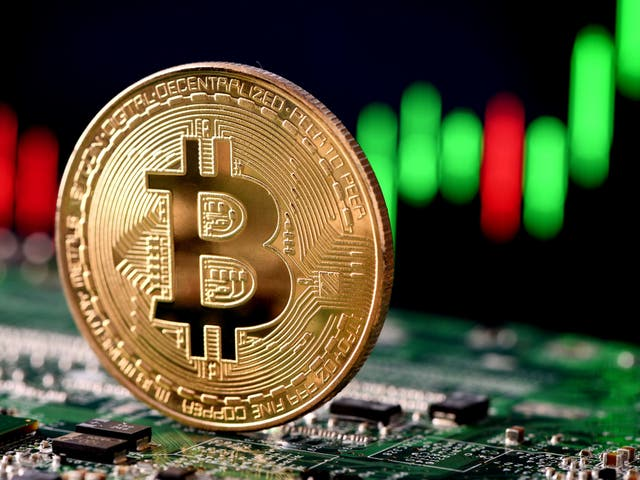

## Welcome to Yorng Chhieng's Page

**What is Bitcoin?**

According to [Forbes](https://www.forbes.com/advisor/investing/what-is-bitcoin/) Bitcoin is a decentralized digital currency that you can exchange, buy and sell without an intermediary like a bank. It is created using blockchain and it is secure since each Bitcoin is encrypted with a unique blockchain.

**Project**

Question: Where can people spend all their bitcoin?

To find the answer to the question, I tried searching for the data and found it [here](datadescription.md)

The following graph shows us the various places where you can spend bitcoin around the world.



